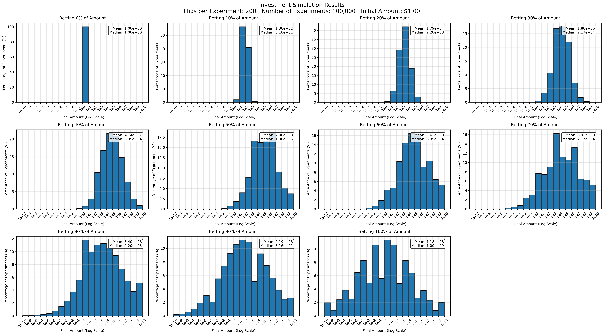

# Stock Position Strategy Simulation
This code simulate the stock market gain/lose situations and is trying to figure out a best strategy for the stock market, e.g. how many percentage of asset should be put in stock market.

This program is a re-evaluation of https://www.youtube.com/watch?v=9FlsmNJRSr0&t=5s

## Instructions:
- install packages: `pip install -r requirements.txt`
- modify parameters in simu.py
- run code with: `python simu.py`

## Parameters
- win rate, e.g. 2.0 means double when win
- lose rate, e.g. 0.5 means half when lose
- NUM_EXPERIMENTS is self-explanatory
- Flip range parameters specify the range of flips, (100, 501, 100) means we will do the experiments 5 times with num_flips=[100, 200, 300, 400, 500]

## Result:
More pictures can be found in results folders. I think medin results make more sense here. 

## Conclusion:
In case of winning, (The product of win rate and lose rate has to be greater or equal than 1.0 to get profit, e.g. 1.25\*0.8>=1.0, 2.0\*0.5>=1.0)
- 50% asset on bet maximize the median results (I think median makes more sense in this case compare to mean result). 
- try to improve wining ratio, e.g. (2.0, 0.5) is better than (1.25, 0.8)
- the more experiments, the more gains, 400 experiments are better than 200 experiments

In case of lose (The product is less than 1.0, e.g. 1.2*0.8<1.0):
- put less percentage of assets on bet
- Do less rounds of experiments

## Tech Stack
- Python

## Special Thanks
**Cursor AI: https://www.cursor.com/**